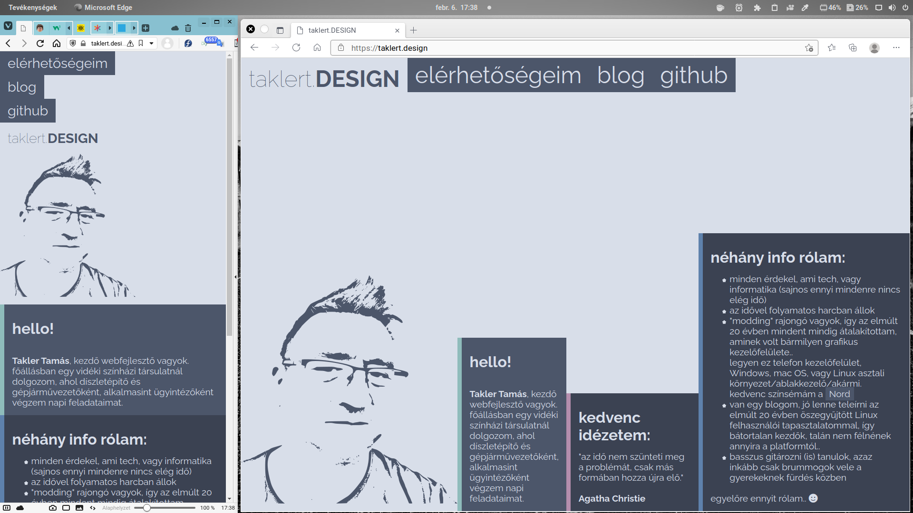

**taklert.design - azaz, a bemutatkozó oldalam**
 A saját weboldalam kezdeti design és kód tervezete. Amit még meg szeretnék valósítani:
- a "hero" képet le fogom cserélni png-ről svg-re, hogy kódból tudjam színezni scriptelni, majd ha már tanulok egy kis JS-t, jQuery-t, VueJS-t, akármit..
  persze gondolkozom egy igazi Linux-neckbeard megoldáson is: bash scriptből módosítani a színsémát a szerveren napszaknak megfelelően.. de ez még a távoli jövő :-D

